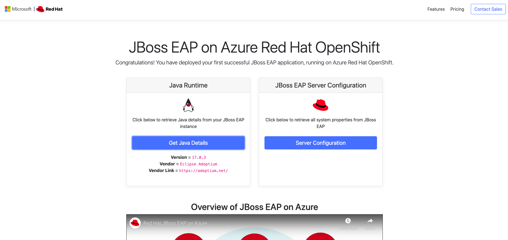

# Red Hat JBoss EAP on Azure Red Hat OpenShift Hello World

This is a simple application that demonstrates a basic deployment of an application Azure Red Hat OpenShift.

Just build it with `mvn package` and then deploy the resulting WAR file to JBoss.